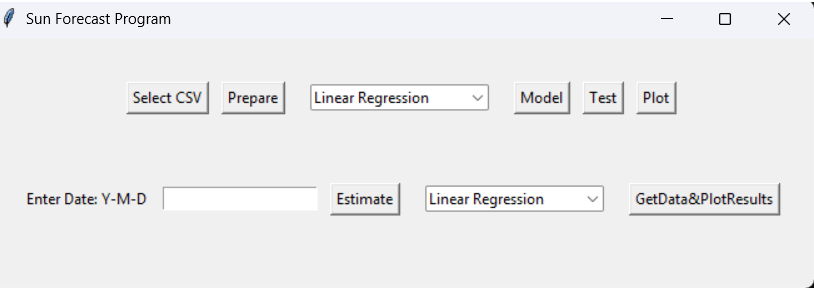

# Python-Based Solar Activity Predictor
Inspired by Google's solar energy estimator and the codebase available at glassb/solar-forecast, I have explored Python-based software that forecasts solar activity using input solar irradiance data.

The solar activity forecasting code leverages the pvlib Python library to obtain accurate solar irradiance data. This library provides a comprehensive suite of tools for modeling photovoltaic systems, including functions for calculating clear-sky irradiance, solar position, and atmospheric conditions. These features were instrumental in building a reliable and data-driven forecasting model.

A three-year dataset of solar irradiance was used to train the forecasting model, enabling daily predictions of solar activity. The project implemented both Linear Regression and Random Forest Regressors to evaluate performance. Among the two, the Random Forest Regressor consistently delivered more accurate results. Model outputs were benchmarked against pvlib's clear-sky irradiance estimates to assess reliability and precision.

The model includes good testing capabilities, and visualization functions are provided to plot both the test results and daily solar activity predictions for easier analysis and interpretation.

The pvlib library provides robust capabilities for photovoltaic (PV) system design and analysis. As part of future development, these features will be further explored and integrated to support the goal of building a comprehensive web-based application.

